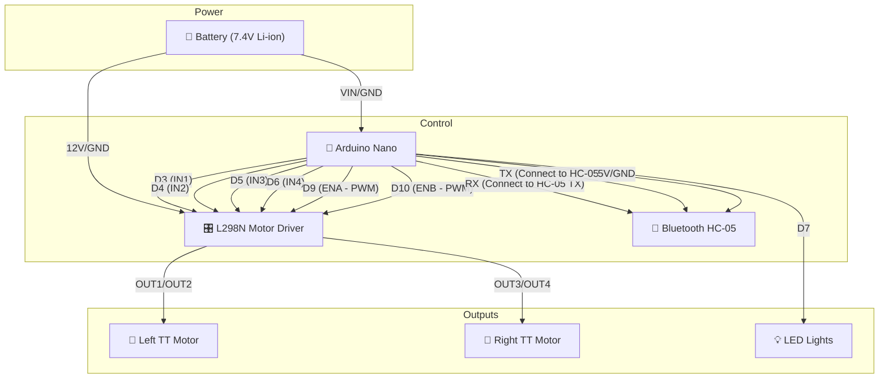
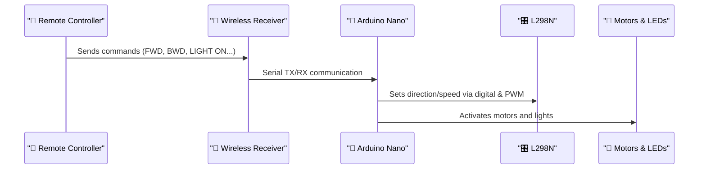

# 💪 Hunter's RC Tank Build Plan

## 🧠 Project Concept

Hunter's custom-built toy tank will be:
- Fully 3D printed
- Controlled wirelessly
- Capable of moving forward, backward, turning left/right, and rotating in place
- Equipped with LED headlights
- Powered by an internal battery pack

Powered by an Arduino Nano, the tank will use a DAOKI L298N motor driver to control two TT gear motors (left and right tracks), and optionally operate LEDs. Wireless commands are sent via Bluetooth.

---

## ⚙️ Electronics Wiring Diagram



---

## 📡 Communication Flow



---

## 🔌 Recommended Wireless Option

**Bluetooth (HC-05)** module:
- Simple and well-documented
- Pairs with a mobile phone using apps like "Arduino Bluetooth Controller"
- Connected to Arduino via TX/RX (Serial)

---

## 🧱 Phased Build Instructions

### Phase 1: 3D Printing
- [ ] Design or download tank parts (chassis, tracks, wheels, covers)
- [ ] Include mounting spots for Arduino, battery, L298N
- [ ] Print and test-fit components

### Phase 2: Wiring and Assembly
- [ ] Connect motors to L298N OUT1-4
- [ ] Connect IN1-4 and ENA/ENB to Arduino D3–D6
- [ ] Connect LED to D7 (with 220Ω resistor)
- [ ] Connect Bluetooth TX/RX to Arduino RX/TX (or SoftwareSerial)
- [ ] Power system with 7.4V Li-ion battery

### Phase 3: Programming & Testing
- [ ] Upload code to Arduino Nano
- [ ] Use phone app to test movements
- [ ] Adjust speed and motor direction if needed

### Phase 4: Final Assembly
- [ ] Install all electronics into 3D printed shell
- [ ] Secure components and wiring
- [ ] Attach tracks and cover

---

## 🔐 Sample Arduino Code

```cpp
// Pins
#define IN1 3
#define IN2 4
#define IN3 5
#define IN4 6
#define ENA 9
#define ENB 10
#define LED 7

String command;

void setup() {
  // Motor control pins
  pinMode(IN1, OUTPUT);
  pinMode(IN2, OUTPUT);
  pinMode(IN3, OUTPUT);
  pinMode(IN4, OUTPUT);
  pinMode(ENA, OUTPUT);
  pinMode(ENB, OUTPUT);
  
  // LED pin
  pinMode(LED, OUTPUT);

  // Start serial comms
  Serial.begin(9600);
}

void loop() {
  if (Serial.available()) {
    command = Serial.readStringUntil('\n');
    command.trim();
    handleCommand(command);
  }
}

void handleCommand(String cmd) {
  if (cmd == "FWD") forward();
  else if (cmd == "BWD") backward();
  else if (cmd == "LEFT") turnLeft();
  else if (cmd == "RIGHT") turnRight();
  else if (cmd == "STOP") stopMotors();
  else if (cmd == "LIGHT ON") digitalWrite(LED, HIGH);
  else if (cmd == "LIGHT OFF") digitalWrite(LED, LOW);
}

void forward() {
  digitalWrite(IN1, HIGH);
  digitalWrite(IN2, LOW);
  digitalWrite(IN3, HIGH);
  digitalWrite(IN4, LOW);
  analogWrite(ENA, 200);
  analogWrite(ENB, 200);
}

void backward() {
  digitalWrite(IN1, LOW);
  digitalWrite(IN2, HIGH);
  digitalWrite(IN3, LOW);
  digitalWrite(IN4, HIGH);
  analogWrite(ENA, 200);
  analogWrite(ENB, 200);
}

void turnLeft() {
  digitalWrite(IN1, LOW);
  digitalWrite(IN2, HIGH);
  digitalWrite(IN3, HIGH);
  digitalWrite(IN4, LOW);
  analogWrite(ENA, 180);
  analogWrite(ENB, 180);
}

void turnRight() {
  digitalWrite(IN1, HIGH);
  digitalWrite(IN2, LOW);
  digitalWrite(IN3, LOW);
  digitalWrite(IN4, HIGH);
  analogWrite(ENA, 180);
  analogWrite(ENB, 180);
}

void stopMotors() {
  digitalWrite(IN1, LOW);
  digitalWrite(IN2, LOW);
  digitalWrite(IN3, LOW);
  digitalWrite(IN4, LOW);
  analogWrite(ENA, 0);
  analogWrite(ENB, 0);
}
```

### Code Explanation
- `setup()`: Initializes pin modes and starts serial communication.
- `loop()`: Listens for serial input and calls `handleCommand()`.
- `handleCommand()`: Decides which action to take based on command.
- `forward()`, `backward()`, `turnLeft()`, `turnRight()`: Motor movement functions.
- `stopMotors()`: Halts all motor movement.
- `LIGHT ON` / `LIGHT OFF`: Control LED headlight on pin D7.

---

Let me know if you’d like a printable checklist, a version for NRF24L01 instead of Bluetooth, or STL model recommendations for the chassis!

